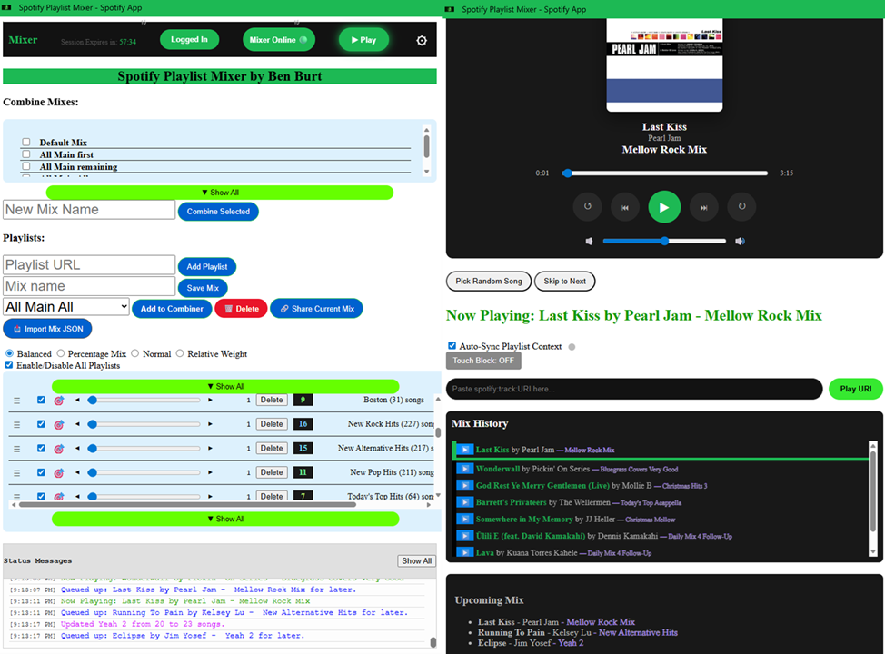
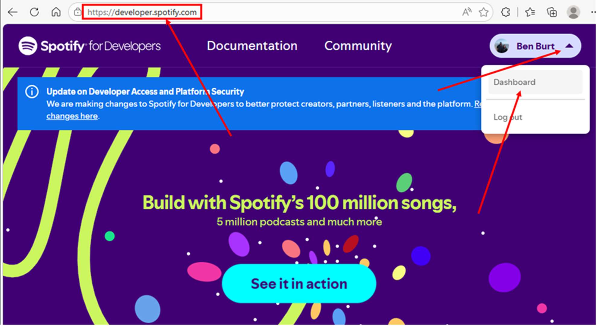
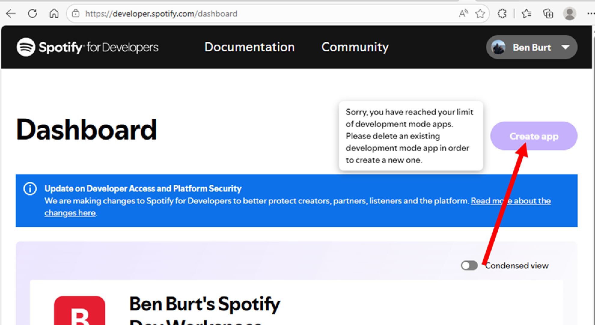
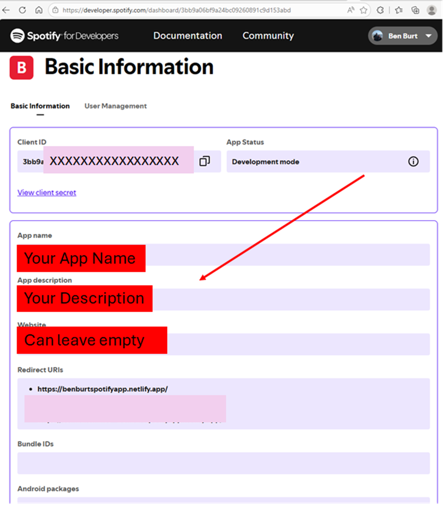
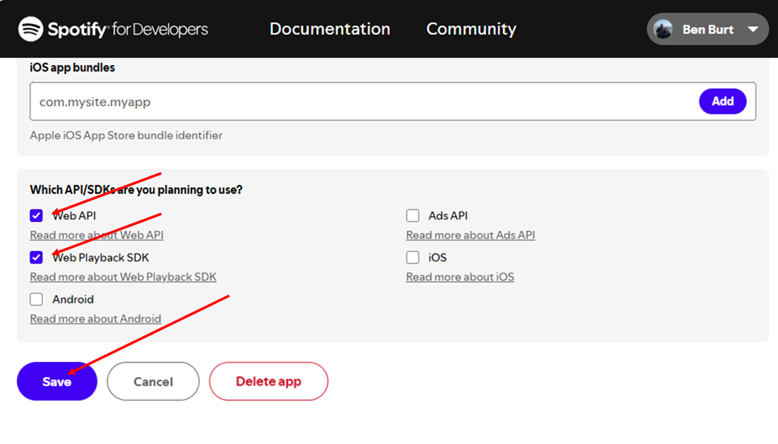
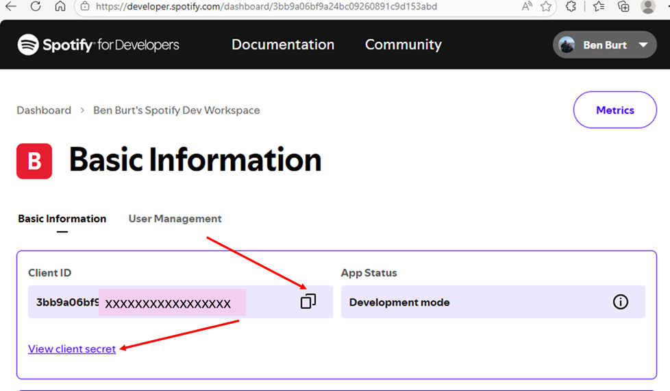
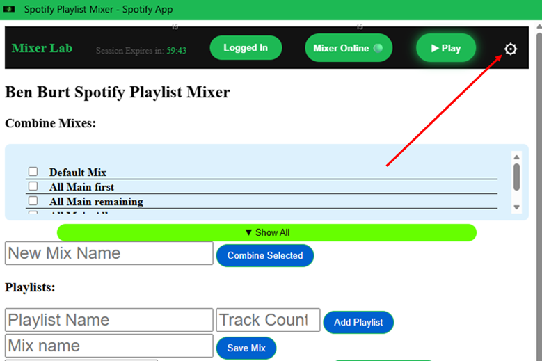
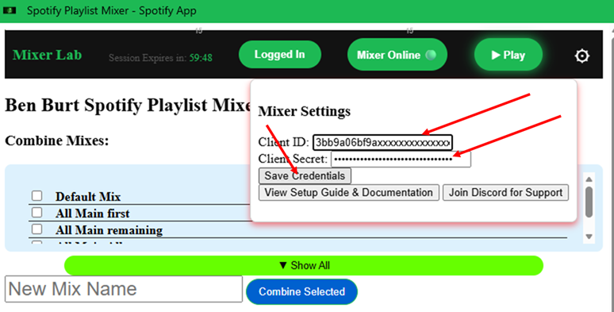
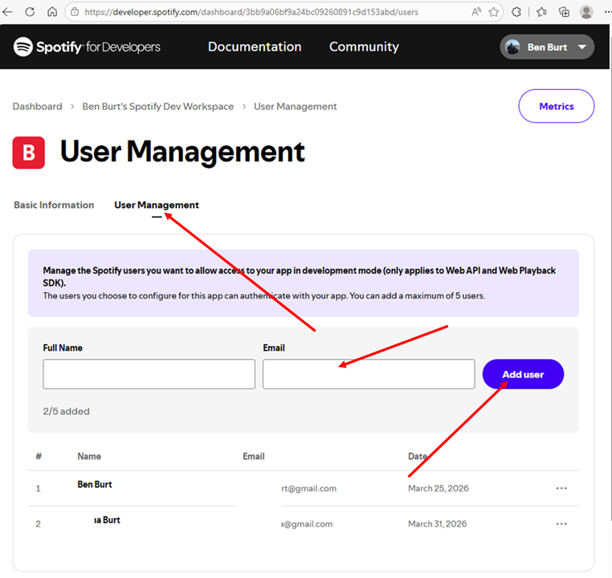

.
# 🎧 Spotify Playlist Mixer 🎧

Welcome to the **Spotify Playlist Mixer App by Ben Burt**! 

* Disclaimer: This documentation guide is evolving. I will add more descriptions and walk-through of features, nuances, and limitations as I have time. So be patient. Feel free to reach out to me with questions.

## 📖 Introduction and Description 📖

To be simple, this App let's you mix multiple Spotify Playlists together into one music listening session!

The **Spotify Playlist Mixer by Ben Burt** is a custom Application designed for Spotify power users who want more granular control over their Spotify playback experience. It is a powerful playlist mixing engine that puts DJ-style playlist curation tools directly in your hands. Unlike Spotify's native playlist features, this mixer lets you algorithmically combine multiple playlists in one continuous music session, giving you unprecedented control over how your music session flows. Spotify Playlist Mixer provides you new ways of organizing your music and sculpting unique music listening sessions.

## How It Works

1. Connect Your Spotify Account

   Simply log in with your Spotify credentials. If you are "hosting" yourself and others as users of this app, you will need to configure the "Client ID" and "Client Secret" <This is covered lower>

   This Mixer App uses Spotify's secure OAuth authentication.

2. Add Your Playlists to a Mix

   Copy the URLs of the Playlists you want from Spotify. You can include your favorite curated collections, any of the playlists that YOU have created in Spotify.

3. Choose Your Mixing Configuration

   Select how you want tracks blended. Choose from 4 playlist mixing algorithms and tune to your liking.

4. Play

## Why Spotify Playlist Mixer?

### Problem: Spotify's LImitations

* Can't mix/blend playlists - especially with weighted/percentage algorithms
* Users can't control the random song selection in Spotify
* Specific moods for a music session require separate manually-created Playlists

### Solution: Spotify Playlist Mixer
* Algorithmic Playlist Mixing / Blending
* Full control / transparency over your mixing formula
* Zero restrictions on how you mix

## Use Cases
* Party Hosts: Create the perfect blend of different genres for different crowds
* Commuters: Mix upbeat morning playlists with focus tracks for the workday
* Researchers: Analyze how different playlist combinations affect listening patterns
* Radio Listeners: Combine your top hits with an introduction of "newer songs" at your chosen frequency
* Music Enthusiasts: Explore cross-genre combinations you'd never discover manually

## What is **Spotify Playlist Mixer**

Years back, Spotify temporarily had a feature where you could pick multiple playlists and play a random mix of them. It was short lived, and they removed the useful feature. Even though many continue to ask for this feature, there is little movement on bringing anything like it back. Currently, the only way to mix playlists is to use the Spotify Desktop Application, where you can pull multiple playlists into the same folder and then "Play the folder". This feature is not available on Mobile, nor on the Spotify Web App at this point.

This Spotify Playlist Mixer allows you to do that, but so much more. You are able to have much more control over how often songs are chosen from each playlist in the mix. Increase the percentage, or fine-tune it by giving it a more granular "weight". Adjust the mix on the fly.

You can save mix configurations for re-use. You can enable/disable specific playlists in a saved mix configuration for more fine-tuned listening. You can play just one song from a playlist at your own desire. You can also mix the mixes themselves - by combining saved mixes into a new mix of the playlists from both mixes.

You can test out your mix configuration to see if a numbered selection of many songs would fit the desired mix and frequency of each playlist. You can see how often a playlist is being called from your mix.

You no longer have to manually combine playlists together and keep the same songs updated in multiple playlists, just mix smaller fine-tuned playlists. You can exceed the 10,000 song limitation of Spotify playlists, by combining multiple in a mix.

This application acts as a remote "brain" for your Spotify account. By utilizing the **Spotify Web API** and **Spotify Web Playback SDK**, it monitors your active Spotify session and provides advanced features not found in the standard Spotify client.

This Spotify Playlist Mixer lets you:
* Combine multiple playlists into Mix configurations, allowing various settings for how to mix them.
* Control blend percentages / ratios with even precise weighting if desired (e.g. 40% Jazz, 35% Lo-fi, 25% Synthwave).
* Save Mix configurations as reusable recipes.
* Save and transfer Mix configurations to other devices.
* Play Seamlessly (or nearly seamlessly) with full playback controls, queue management, and built-in error handling.

Think of it as a **mashup machine for your playlists** - It's Spotify, but with some sophistication you've always wanted.

This app is designed so it can be run in a Web Browser Tab, OR it can also be installed on your phone as a stand-alone App or as a App in your Browser (Chrome, Edge, etc). When it is installed as an App on your phone or as an App in your web browser, it runs as a Progressive Web App (PWA). Essentially, it is a browser tab wrapped inside of an App to give a bit more functionality and make some of the features run better than a web browser tab [especially when running on a Phone]

### WHY PWA (Progressive Web App) ???

This started as a web broswer tab, which works great if you are using it on a Desktop computer. However a web browser tab on a phone presents many many complications. Mobile phones are extremely aggressive at limiting needed resources and focusing on "what you're looking at right now". As such, phones try to freeze background tasks and especially web browser tabs aggressively. Shut down the tools they are using, shut down their memory, shut down their connections.

This app attempts to put some measures in place to keep the web browser tab running as much as possible when it's in the background. It tries to trick the browser and the phone to keep itself alive.

One of the better ways of keeping this app alive on a phone is to move the web browser tab into a PWA (Progressive Web App). It's not quite identical to an actual stand-alone phone application, but it bridges the gap. It lets the phone start to treat some aspects of the app as if it were an full stand-alone app.

Running as a PWA allows added protection against your mobile phone putting the browser tab or application in the background and suspending its activities.

There is much more to read and learn about how this application is setup, the reasoning behind how it is designed, and all of its features, and potential future features. But for now, let GET YOU GOING ALREADY! 

Let's get you set up!

**A more detailed "Project Description" is lower below the "Setup Guide"**

# ⚙️ Setup Guide ⚙️

First of all, if you haven't seen the app yet, access it here:
# [https://benburtspotifyapp.netlify.app/](https://benburtspotifyapp.netlify.app/)

Currently, the Spotify features used in this playlist mixer require the user to first have a **Spotify Premium** account. They **also** require the user to either set up the account as a **Spotify Developer Account (not as hard as it sounds)** or be one of 4 friends/family (5 including the main account) of a Spotify user with a **Spotify Developer Account**.

Because this is a developer-tier tool, there are a few steps to connect your Spotify account. This guide will walk you through obtaining your credentials and configuring the app.

---

## 🔧 Initial Setup 🛠

### 1. Create a Spotify Developer App
To use this mixer, you must act as your own "developer."
1. Go to the [Spotify Developer Dashboard](https://developer.spotify.com/dashboard).

   Or you can to get it it here:

<!--  -->

2. Log in with your standard Spotify account.
3. Click **Create app**. Obviously, I already have my app (Spotify only lets us have one as individual developers). You see it listed below in the Dashboard.

.

4. **App name**: `My Spotify Playlist Mixer` (or anything you like).
5. **App description**: `Custom PWA mixer for my playlists.`
6. **Website**: You can leave this blank.
7. **Redirect URIs**: You **must** add exactly this URL:
   `https://benburtspotifyapp.netlify.app/`. This is where my Spotify Playlist Mix App is hosted and the app that needs to receive your Spotify credentials after being re-directed from the Spotify Login/Authorize screen/page.

.

8. Check the boxes for **Web API** and **Web Playback SDK**.
9. Save the app.

.

### 2. Get Your Credentials
1. In your new app dashboard, click **Settings**.
2. Find your **Client ID** and **Client Secret**.
3. Copy these and paste them into the **Settings Menu (⚙️)** in the Mixer PWA.
   * *Note: Your Client Secret is like a password. Do not share it!*

.

.

.

### 3. Authorize Your Email (Crucial)
Because this app is in "Development Mode," Spotify requires you to explicitly allow users. Each Spotify Developer (yourself now that you have a developer client ID, etc.) can allow up to 5 users (email addresses) (INCLUDING YOURS) to use this application under your development client ID. So, you can be the access point for 4 (5 including yourself) of your family/friends to be able to use this application.
1. In the Spotify Dashboard for your app, go to the **User Management** tab.
2. Click **Add User**.
3. Enter the **Name** and **Email address** associated with your Spotify account. The **Name** is so you can track yourself who is attached to each email.
4. If you want a friend to use the app, you must add their email here as well. (up to 5 including yourself)

---
# Important information!:
In early 2026, Spotify changed their APIs such that they only work with "user-owned" playlists. Unfortunately, this means that you can't directly add other playlists you find on Spotify to your mixes. Other users own them. However!!! You can make your own "copies" of the playlists you are subscribed to that are owned by others. Then you can import "your" copy of the playlist into this mixer. Unfortunately, this does mean that if the original user modifies their playlist, you won't have their updates unless you make them yourself.

Note that this also means playlists directly owned by Spotify can't be imported, but with the new feature of "Prompted Playlists" by Spotify (a feature currently in beta - and I love it), you can have prompts point to Spotify's playlists and keep weekly or daily updated versions of these playlists as your own "Prompted Playlists". Where you own these playlists, they import into this mixer successfully! And they are able to stay updated as often as the Spotify owned "mixes" or other specialist playlists also stay updated.

And extend the capability of this mixer by using Spotify's prompt suggestions or generating your own playlist prompts. These Prompted Playlists are dynamic - regularly changing according to your schedule, or even your own prompt changes/adjustments.

This essentially allows this mixer to become a configurable Radio Station, regularly introducing you to new music in the genres you desire. So many possibilities with being able to do this.

Unfortunately, Spotify's Prompted Playlists prompts can only look at YOUR playlists or playlists owned by Spotify. It can't look at playlists owned by others, and thus "replicate" their playlist and keep up to date with their updates. Wouldn't that be nice though...

---

# 🌀 Spotify Playlist Mixer by Ben Burt 

## 🛠 Project Description

To be simple, this app let's you mix multiple playlists together!

Are you a Spotify power user? I mean a major power user? I need people to help me test this application. Help me find the bugs. Suggest improvements.

Have you ever wanted to mix multiple Spotify playlists together temporarily for a music listening session? You have many playlists for specific genres, moods, or occasions. But sometimes, you want to want to combine genres or moods without having to maintain a separate playlist that manually combines the songs from multiple playlists. You really want a fine-tuned music session with a specific combination of songs from multiple playlists. Maybe, your friend arrives and you need to tweak the song selection a bit to better fit his taste. Need to adjust the music to accommodate your parents visiting? Do you need to filter out the harder music now that the kids are home?

Want to temporarily add some 90s rock with Irish music? Want to sprinkle some newer music into your existing favorite playlist? Now you can! You can simulate a radio station by focusing most songs on songs you know and love while mixing in new songs as much as you want. Want to temporarily combine some oldies with your normal listening? Maybe you want more 90s alternative for today's season. Maybe mix in some Celtic music. Combine genres for a special Road Trip. Slowly mix some Christmas music into your listening at the beginning of the season. Make virtually any mix you want. 

Years back, Spotify temporarily had a feature where you could pick multiple playlists and play a mix of them. It was short lived, and they removed the useful feature.

Currently, the only way to mix playlists is to use the Desktop Application, where you can pull multiple playlists into the same folder and then "Play the folder". This feature is not available on Mobile, nor on the Spotify Web App at this point.

This Spotify Playlist Mixer allows you do do that, but so much more. You are able to have much more control over how often songs are chosen from each playlist in the mix. Increase the percentage, or fine-tune it by giving it a more granular "weight".

You can save mix configurations for re-use. You can enable/disable specific playlists in a saved mix configuration for more fine-tuned listening. You can play just one song from a playlist at your own desire. You can also mix the mixes themselves - by combining saved mixes into a new mix of the playlists from both mixes.

You can test out your mix configuration to see if a numbered selection of many songs would fit the desired mix and frequency of each playlist. You can see how often a playlist is being called from your mix.

You no longer have to manually combine playlists together and keep the same songs updated in multiple playlists, just mix smaller fine-tuned playlists. You can exceed the 10,000 song limitation of Spotify playlists, by combining multiple in a mix.

Spotify has also placed limitations on creating and using personally developed applications like this. This application has measures in place to allow as many people who want to use it as desire with some additional steps to set it up with your account.

This application acts as a remote "brain" for your Spotify account. By utilizing the **Spotify Web API** and **Web Playback SDK**, it monitors your active session and provides advanced features not found in the standard Spotify client.

This application is designed to be used and run in a web browser tab, OR it can be installed as a Progressive Web App (PWA), and function as a stand-alone application on your phone or as an installed app in your browser (Chrome, Edge).

Running as a PWA allows added protection against your mobile phone putting the browser tab or application in the background and suspending its activities.

While Spotify is excellent at discovering music, it often treats every playlist change as a hard "reset." 

This tool was also born out of a desire to bridge the gap between distinct musical moods — especially for those utilizing Spotify's genre-mixed playlists, AI generated playlists, and the new **Prompted Playlists** beta. Among its abilities to pull multiple types of music together, this App allows you to seamlessly transition between playlists while signaling to Spotify's algorithms that your "Mix" is a continuous, intentional session.

### Core Features:

*  **Intelligent Playlist Blending**: Mix multiple playlists with **four** different song selection algorithms:
   * **Balanced**: Equal distribution for song selection across all enabled playlists, where the probability to chose from each playlist is equal. Somewhat "Round Robin" but with randomness build in!
   * **Percentage Mix**: Define the exact percentages of how often one playlist should be chosen over other playlists using the sliders where all sliders sum to 100.
   * **Normal Weighting**: A straight weighting of all the tracks in the enabled playlists. Each song equally likely to play. This is just a random choice between the sum of all tracks in all playlists of the selected mix.
   * * This means that larger playlists will be chosen more frequently since they have more songs
   * * Useful way to "extend" one playlist over the 10,000 song limit (Hey, I do it!) by combining part 1 playlist wit part 2 playlist, etc.
   * **Relative Weighting**: More granular weighting in case you still want to tweak the "Normal" weighting to prioritize certain playlists more or less, where the probability to choose from a playlist is based off of the slider. This allows you to be much more granular is how you adjust the weights of each playlist.

*  **Advanced Playback Controls**:
   * Full playback control (play, pause, skip, go back (last song), seek (skip forward/backward))
   * Song progress, Volume Control
   * Playback History with ability to go back and play specific songs.
   * Upcoming Queue Preview
   * Reclaiming the playback session when Spotify or other devices try to take over control.

*  🖫 Save & Transfer Your Mixes (Not sharing - I'll explain why later)
   * Save mixes with custom names
   * Organize your playlists in a mix (more features to come here)
   * Export as JSON for backup or transfer to other device/browser
   * Combine multiple saved mix into one Mega-Mix! That's right! Organize your categories of playlists into one mini-mix, then easily combine them as desired for the specific combination of genres you want for a larger mix.

*  📲 Install as Native App
   * Progressive Web App (PWA) support
   * Install to your home screen on mobile or Desktop (adds to your Browser Apps as well)
   * Caches data when offline
   * Native app experience without App Store installation

*  🔏 Brink Your Own Key (BYOK)
   * User your own Spotify Developer credentials to allow device to work with your account and 4 other accounts (current Spotify limitation)
   * Causes your instance of the application to not be limited in Spotify API performance by usage of others utilizing the application.
   * Credentials are stores on YOUR device, not server-side. Thus secure!
   * This facilitates use of the app by as many Spotify users as want to use it really (just in groups of 5)

* More Technical Features
   *   **Intelligent Playlist Context Syncing**: When enabled, the mixer hot-swaps the playback context to your target playlist. This feeds the playlist into Spotify's awareness and algorithm, facilitating unique recommendations by Spotify based on how you are mixing playlists and songs together. This also ensures Spotify’s "Now Playing" and "Next Up" queue reflect your playlist and new mood without an abrupt transition.
   *   **Latency-Aware Playback**: High-precision math accounts for mobile network delays, ensuring that when context swaps occur, the song continues exactly where you left off—down to the millisecond.
   *   **Pocket-Safe Mode**: A dedicated "Touch Block" feature that utilizes the **Screen Wake Lock API** to keep the app active while preventing accidental skips or likes while the phone is in your pocket.
   *   **Privacy-First Architecture**: Built with modern **PKCE Authorization**, your Client Secret and sensitive data are stored locally on your device and never sent to a third-party server.

### Why do I need a Client ID?
Because this app is currently in **Developer/Beta Mode** (And really always will be due to 2026 Spotify limitations), Spotify requires each user of the application to be in a group of 1-5 accounts under a separate Client ID where one user "owns" management of those users. This gives you full control over your data and ensures you are recognized by Spotify as an active participant in their developer ecosystem.

---

## 🛠 Features & How to Use

### Setup

### App Installation (Progressive Web App - PWA)
Instructions coming...

### Powering on device and Playing Music
Instructions coming...

### Adding a new playlist to a Mix
Instructions coming...

### Combining multiple mixes into a new combined Mix
Instructions coming...

### Adding a new playlist to a Mix
Instructions coming...

### Sharing (exporting) and Importing saved Mixes (transferring) to another device (Not actually sharing)
Instructions coming...

### Configuring a mix (enabling, sliders, adjusting, targeting, refreshing)
Instructions coming...

### Testing your Mix Configuration 
Instructions coming...

### Playing on a phone
Instructions coming...

### Interfacing with Bluetooth or Android Auto in a vehicle
Instructions coming...

### Nuances of a Spotify Session and interacting with Spotify App and Web App
Instructions coming...

### 🌀 User-created and Prompted Playlist Mixer
This app allows you to blend your own created Spotify and custom "Prompted Playlists" seamlessly.
* **Context Sync**: Turn this on in settings to ensure Spotify "locks in" your new playlist mood when you change contexts. Ensures your new playlist context "locks in" or is registered with Spotify after an sufficient of play. This will tell Spotify that you're playing the song from the specified Playlist instead of just playing form the Spotify Queue.
* **Pocket Mode**: Toggle **Touch Block** to keep the screen on (ensuring the app stays active) while preventing accidental touches in your pocket.

### ⚠️ Known Limitations
* **Spotify Account Required**
* **Premium Required**: You must have a Spotify Premium subscription for the player to work.
* **Browser Storage**: Your mixes and other data are stored locally - clearing browser data will delete everything you create and save.
* **API rate limits**: Spotify has rate limits on frequecy of API use with these integrated Apps, but this Mixer App respects them and is self-governing to prevent rate limits.
* **Playlist size**: Spotify limits playlists to 10,000 tracks. But it doesn't matter because you can combine all the playlists you want into one mix here!
* **Workplace Autoplay**: If using **Edge** or **Chrome** at work, your administrator may have disabled "Auto Play" in your browser settings, which will often (not always) cause the next song to be paused after the end of the previous song. You may need to manually click "Play" once the next or even the first track is loaded due to strict browser autoplay policies. **Chrome** is recommended for the best experience, where is allows policies to be more... "loose" we'll say.

### Frequently Asked Questions

Q: Is this app free?
A: Yes, completey free. No premium tiers, no hidden costs. Donations are accepted (haven't set anything up yet).

Q: Does this work on Mobile?
A: Yes. Visit the app in your mobile browser or install it as a native app (PWA).

Q: Can I share mixes with friends?
A: Technically no as Spotify requires that users only use Playlist that they created or own. But I have some ideas of how we could make something work.

Q: Will this affect my Spotify Account?
A: Nope. Potentially we can create new playlists from your mixes, but not a feature yet. These configurations exist outside of the Spotify App itself.

Q: Is it safe to connect my Spotify Account?
A: Yes, This App uses Spotify's official OAuth2 authentication - the same security model as all verified Spotify integrations.

Q: Can I undo a mix?
A: Yes, Mix Configurations are just linked to normal Spotify Playlists. You can delete saved Mixes and also delete individual playlists from any Mix.

Q: What's the difference between mix "modes"?
A: This is explained well above.

---

## 💬 Feedback & Support

Found a bug or have a suggestion?
This is an evolving application. I will be periodically pushing out new versions with new features, modifications, and fixes. I am the only one working on this application. It is a side hobby really. I will address things as time permits. But I do hope you find this application useful and enjoyable. While I may not have capacity to add all of your suggested features or make it work just the way you want, I'll see what I can do. You're welcome to provide me your suggestions and greivances with the application. But know that I may lean a bit towards what "I" want feature and performance wise.

* Email: ben.burt.spotify@gmail.com
* Twitter: @BenBurtSpotify
* Reddit: u/Legal_Resource_107
* Facebook: [facebook.com/bigbenburt](https://facebook.com/bigbenburt)

* **Bugs**: Open an issue on our [GitHub Repository](https://github.com).  **Currently disabled, I may bring this back at a later time**
* **Community**: Join our **Discord Server** [Invite Link Here] to chat about the app and get real-time help!

## Start Mixing!

Ready to unleash the full power of playlists? Get Spotify Playlist Mixer set up and create your first mix!

Spotify Playlist Mixer by Ben Burt is an independent project build with 💖 and is not affiliated with, endoresed by, or officially associated with Spotify AB or Spotify USA Inc.
